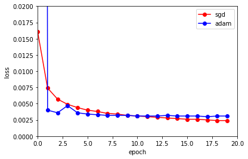

# 运筹学课堂作业——实现ADAM

> Kingma, Diederik P., and Jimmy Ba. "Adam: A method for stochastic optimization." arXiv preprint arXiv:1412.6980 (2014).

## 1. 问题描述

Adam是一种自适应学习率的优化方法。

本实验分别实现SGD和Adam，并使用AlexNet在Fashion Minist分类问题上进行测试，考察不同的优化算法在非凸优化问题上的loss下降情况。

### 1.1. 实验环境
 
 - 数据集：Fashion Minist图像
 - 模型：AlexNet
 - Loss函数：Cross Entropy
 - 计算卡：NVIDIA 1080ti（cuda:11.7）（CPU亦可）
 - 语言：Python 3.8.13
 - 主要依赖库：Python torch 1.12.1+cu102（CPU为1.12.1）
 - 参考文献：
   - Kingma, Diederik P., and Jimmy Ba. "Adam: A method for stochastic optimization." arXiv preprint arXiv:1412.6980 (2014).
   - Zhang, Aston, et al. "Dive into deep learning." arXiv preprint arXiv:2106.11342 (2021).

### 1.2. 实验过程

```shell
$ git clone git@github.com:pulgawang/operations_research.git
$ cd operations_research
$ pip install -r requirements.txt
$ python homework/main.py --optim [sgd,adam]
```

## 2. 实验过程
### 2.1. SGD实现
```python
# 更新参数，减去lr*梯度
# d_p_list为params的梯度，lr为learning_rate
for i, param in enumerate(params):
    d_p = d_p_list[i]
    alpha = -lr
    param.add_(d_p, alpha=alpha)
```
### 2.2. Adam实现
```python

```

## 3. 实验结果

### SGD
```text
epoch: 0, train loss: 0.01607, train acc: 0.251, test acc: 0.534, escape time: 79.1s
epoch: 1, train loss: 0.00740, train acc: 0.637, test acc: 0.717, escape time: 81.2s
epoch: 2, train loss: 0.00566, train acc: 0.728, test acc: 0.762, escape time: 78.7s
epoch: 3, train loss: 0.00485, train acc: 0.766, test acc: 0.779, escape time: 81.1s
epoch: 4, train loss: 0.00439, train acc: 0.789, test acc: 0.808, escape time: 80.9s
epoch: 5, train loss: 0.00404, train acc: 0.806, test acc: 0.822, escape time: 85.1s
epoch: 6, train loss: 0.00377, train acc: 0.821, test acc: 0.822, escape time: 79.0s
epoch: 7, train loss: 0.00354, train acc: 0.833, test acc: 0.843, escape time: 79.5s
epoch: 8, train loss: 0.00336, train acc: 0.841, test acc: 0.849, escape time: 79.3s
epoch: 9, train loss: 0.00321, train acc: 0.848, test acc: 0.849, escape time: 82.0s
epoch: 10, train loss: 0.00306, train acc: 0.857, test acc: 0.863, escape time: 81.2s
epoch: 11, train loss: 0.00296, train acc: 0.861, test acc: 0.865, escape time: 78.3s
epoch: 12, train loss: 0.00287, train acc: 0.866, test acc: 0.868, escape time: 81.0s
epoch: 13, train loss: 0.00278, train acc: 0.871, test acc: 0.874, escape time: 84.0s
epoch: 14, train loss: 0.00272, train acc: 0.874, test acc: 0.871, escape time: 80.3s
epoch: 15, train loss: 0.00263, train acc: 0.876, test acc: 0.875, escape time: 79.5s
epoch: 16, train loss: 0.00257, train acc: 0.880, test acc: 0.880, escape time: 79.5s
epoch: 17, train loss: 0.00251, train acc: 0.882, test acc: 0.881, escape time: 79.8s
epoch: 18, train loss: 0.00244, train acc: 0.886, test acc: 0.882, escape time: 78.9s
epoch: 19, train loss: 0.00241, train acc: 0.887, test acc: 0.884, escape time: 80.8s
```

### Adam
```text
epoch: 0, train loss: 0.90952, train acc: 0.705, test acc: 0.810, escape time: 83.2s
epoch: 1, train loss: 0.00396, train acc: 0.810, test acc: 0.811, escape time: 82.7s
epoch: 2, train loss: 0.00364, train acc: 0.824, test acc: 0.830, escape time: 81.7s
epoch: 3, train loss: 0.00470, train acc: 0.797, test acc: 0.825, escape time: 82.0s
epoch: 4, train loss: 0.00357, train acc: 0.828, test acc: 0.824, escape time: 80.4s
epoch: 5, train loss: 0.00344, train acc: 0.835, test acc: 0.823, escape time: 85.7s
epoch: 6, train loss: 0.00333, train acc: 0.840, test acc: 0.841, escape time: 81.1s
epoch: 7, train loss: 0.00322, train acc: 0.845, test acc: 0.845, escape time: 82.8s
epoch: 8, train loss: 0.00317, train acc: 0.847, test acc: 0.841, escape time: 84.8s
epoch: 9, train loss: 0.00318, train acc: 0.846, test acc: 0.841, escape time: 82.7s
epoch: 10, train loss: 0.00314, train acc: 0.850, test acc: 0.851, escape time: 83.2s
epoch: 11, train loss: 0.00313, train acc: 0.850, test acc: 0.839, escape time: 83.0s
epoch: 12, train loss: 0.00311, train acc: 0.849, test acc: 0.849, escape time: 83.3s
epoch: 13, train loss: 0.00315, train acc: 0.849, test acc: 0.848, escape time: 82.0s
epoch: 14, train loss: 0.00310, train acc: 0.851, test acc: 0.845, escape time: 81.5s
epoch: 15, train loss: 0.00311, train acc: 0.850, test acc: 0.852, escape time: 82.4s
epoch: 16, train loss: 0.00307, train acc: 0.852, test acc: 0.846, escape time: 83.2s
epoch: 17, train loss: 0.00304, train acc: 0.853, test acc: 0.848, escape time: 83.9s
epoch: 18, train loss: 0.00305, train acc: 0.854, test acc: 0.851, escape time: 78.6s
epoch: 19, train loss: 0.00310, train acc: 0.851, test acc: 0.856, escape time: 73.9s
```

### 对比


### 结论

从实验结果上来看，此例中：
 - SGD方法传统下降缓慢，但是在相同的迭代次数内能够达到更优的效果
 - Adam优点为下降速度更快，但是由于学习率的调整，后续下降逐渐缓慢，另外，Adam需要调整beta和eps参数，引入了更多参数，影响易用性（即使作者给出了建议参数）

## TODO
 - SGD + Momentum/Nesterov
 - NAdam（Adam + Nesterov）